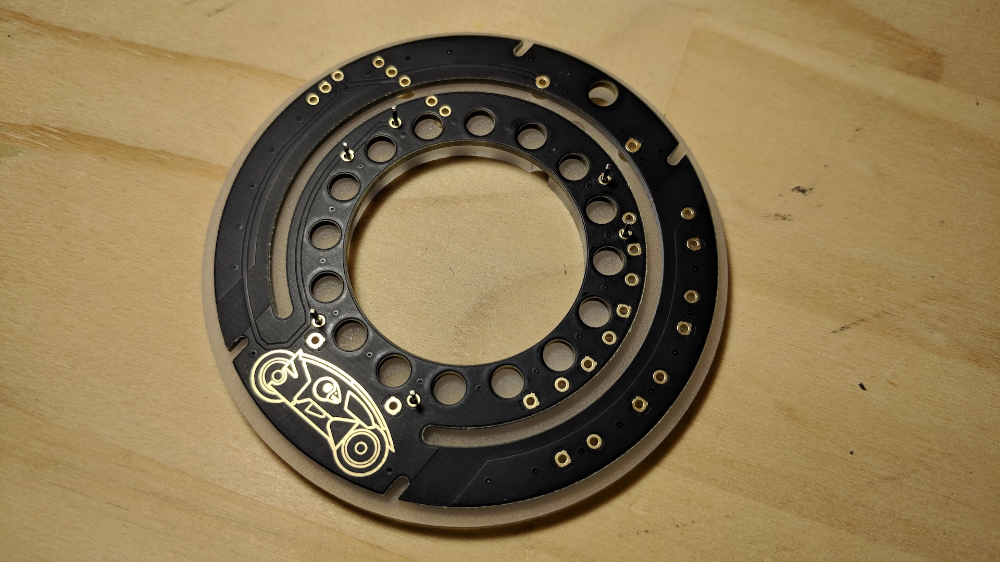

# How to assemble your badge

You will need:
* Soldering iron
* Side cutters
* Safety glasses
* Ventilation


## Step 1

Make sure you have all the parts. You should have in your bag:

* 1 x battery holder + boost converter
* 1 x attiny85 microcontroller board + headers
* 1 x acrylic disk
* 1 x black round PCB with CHCon logo
* 1 x led ring, with 16 RGB leds
* 1 x additional headers


## Step 2

Cut the headers into smaller strips with the side cutters so you have:

```
10 x 1-pin
2 x 3-pin
1 x 2-pin
```

> Note: rest your finger on the end you are cutting off so it doesn't fly away. Wear safety glasses.

Get the 2-pin header, and push it through the back of the PCB, and solder it onto the front (side with the logo).

This step will save us from headaches later. Don't over-do it with solder on these pins, as we won't have much space later on.


## Step 3

On six of the single pin headers, cut off the shorter end with the side cutters.

> Note: same as above, rest your finger on the end you are cutting off so it doesn't fly away. Wear safety glasses.


## Step 4

Peel the backing off the acrylic disk.
Place the six pins in the disk as shown.


## Step 5

Lay the PCB on top of the 6 pins.




## Step 6

Place the led ring on top of the 6 pins, so that the pins are only just in the holes.

Solder the pins on the bottom PCB.

Push the ring down on the pins.

Solder the pins on the top of the led ring.

> Wear safety glasses, and have proper ventilation while soldering.


## Step 7

Flip the disk over.

Place the 2-pin, and two 3-pin headers into the disk as shown


## Step 8

Push the attiny85 board onto the pins, and solder.

> Wear safety glasses, and have proper ventilation while soldering.


## Step 8a

We need to fix a happy-little-PCB-accident to the board.

Get some wire and connect two pins on the digispark, 5V and VIN. Like so:


## Step 9

Solder on the other side too.

> Wear safety glasses, and have proper ventilation while soldering.


## Step 10

Place the four remaining 1-pin headers like so:


## Step 11

And solder the battery holder on. Note the orientation must be correct. On/Off switch away from the attiny85 board.

Make sure to solder the other side too.

> Wear safety glasses, and have proper ventilation while soldering.


## Done

What are the other holes for? Buttons that are somewhere between Shanghai and Auckland :(

You should be able to solder on tactile switches and use them as inputs on the Digispark.

Now you can try the [Badge Challenge](CHALLENGE.md)
